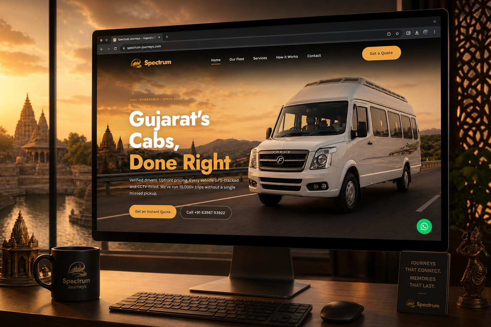

<div align="center">

# Spectrum Tours & Travels

### *Gujarat's Cabs, Done Right.*

[](https://www.spectrumtourandtravels.in)
[](https://github.com/IshaShaikh-03/spectrum-journeys)
[](https://github.com/IshaShaikh-03/spectrum-journeys)
[](https://github.com/IshaShaikh-03/spectrum-journeys/commits/main)

</div>



Spectrum Tours & Travels is a premium travel agency based in Ahmedabad, Gujarat — serving customers since 2008 with a fleet of Tempo Travellers, Innova SUVs, and Luxury Buses. This website is their complete digital presence: a fast, conversion-focused single-page site that showcases the fleet, services, and trust signals, turning visitors into WhatsApp leads and bookings in under two clicks. Built with zero framework overhead — pure Vanilla HTML, CSS, and JavaScript deployed directly to Vercel.

## Features

- **Conversion-optimised UX** — Sticky mobile CTA bar (Call Now + WhatsApp), one-click booking modal, and prominent inline quotes.
- **Premium fleet showcase** — Browse Innova SUVs, Sedans, Tempo Travellers, and Luxury Mini Buses with capacity and feature details.
- **Scroll-reveal animations** — Every section fades and slides in using a custom `IntersectionObserver` — zero libraries.
- **Fully responsive** — Complete mobile layout overhaul. Tested from 320px to 4K. Isolated in `mobile.css`, desktop untouched.
- **SEO ready** — Full meta tag suite, Open Graph, Twitter Card, JSON-LD `TravelAgency` structured data.
- **Zero build step** — Open `index.html`, done.
- **Accessible** — Semantic HTML5, ARIA labels, focus-visible outlines, skip-to-content link.

## Live Sections

| Section | What It Does |
| --- | --- |
| **Hero** | Full-viewport dark hero with left-aligned headline, animated badge, and stacked CTAs |
| **Trust Marquee** | Infinite scrolling strip — Verified Drivers, Clean & Sanitized, No Hidden Costs |
| **Stats Ribbon** | 4 key stats — 15+ years, 50+ vehicles, 10K+ clients, 24/7 |
| **Fleet** | Vehicle cards with image, capacity chips, and enquiry CTA |
| **Routes & Packages** | Popular route cards with itinerary teasers |
| **Services** | 6 service cards — Airport, Outstation, Pilgrimage, Corporate, Wedding, Sightseeing |
| **How it Works** | 3-step dark journey grid with numbered badges |
| **Testimonials** | Dark card grid with star ratings, quotes, and author avatars |
| **Contact** | Bento-style layout — 3 info cards + full contact form |

## Stack

| Layer | Technology |
| --- | --- |
| Markup | Semantic HTML5 |
| Styling | Vanilla CSS with CSS Custom Properties |
| Mobile | Dedicated `mobile.css` — media queries isolated from desktop styles |
| Interactivity | Vanilla JavaScript (ES6+) |
| Icons | [Font Awesome 6](https://fontawesome.com/) (CDN) |
| Typography | Plus Jakarta Sans (display) · Inter (body) |
| SEO | Schema.org `TravelAgency` JSON-LD + full Open Graph suite |
| Hosting | [Vercel](https://vercel.com/) |

## Design System

All design tokens are defined as CSS custom properties at the top of `styles.css`:

```css
--brand-primary:   #E8A838;   /* Warm Amber Gold */
--surface-dark:    #111111;   /* Deep black — hero, CTA strip, footer */
--surface-mid:     #1F1F1F;   /* Dark charcoal — testimonials, stats */
--surface-light:   #F5F0E8;   /* Warm off-white page background */
```

<details>
<summary>Quick Start</summary>

No build step required.

```bash
git clone https://github.com/IshaShaikh-03/spectrum-journeys.git
cd spectrum-journeys
```

Open directly:

```bash
start index.html   # Windows
open index.html    # macOS
```

Or with a local dev server:

```bash
python -m http.server 8080
# or
npx serve .
```

Open `http://localhost:8080`.

</details>

<details>
<summary>Changelog</summary>

### v2.2.1 — 2026-04-22
- fix: revert testimonial cards to dark charcoal background

### v2.2.0 — 2026-04-22
- feat: complete mobile responsive overhaul — all sections stack gracefully on ≤768px
- fix: eliminated horizontal scrolling on mobile
- fix: nav hamburger menu properly isolated, desktop CTA hidden on mobile
- fix: contact bento box collapses to single column on mobile
- fix: footer columns stack with proper spacing

### v2.1.0 — 2026-04-22
- feat: premium "Soft Premium Light" design system — Warm Amber-Gold palette, CSS tokens
- feat: hero, trust marquee, stats ribbon, fleet cards, route cards, services grid
- feat: "How it Works" dark 3-step journey, testimonials, CTA strip, contact bento box
- feat: sticky mobile CTA bar — Call Now + WhatsApp
- feat: booking modal — full quote capture form

### v2.0.0 — 2026-04-21
- refactor: full migration from React 19 + Tailwind v4 + Vite to Vanilla HTML/CSS/JS

</details>

<div align="center">

Designed & developed by **[The Algothrim](https://thealgothrim.com)** for Spectrum Tours & Travels, Ahmedabad.

</div>
