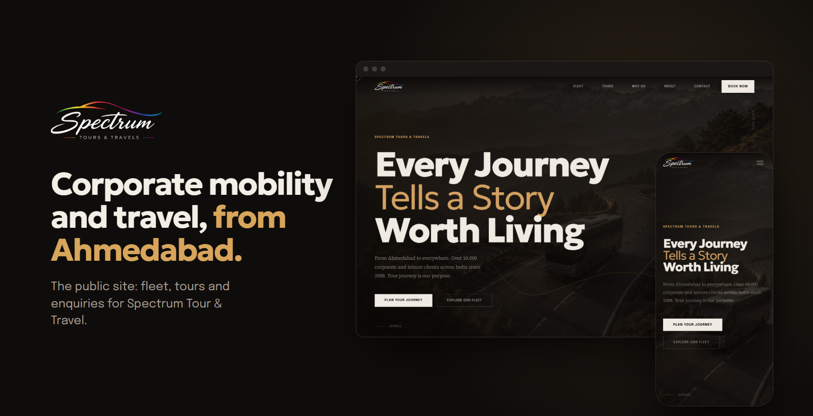
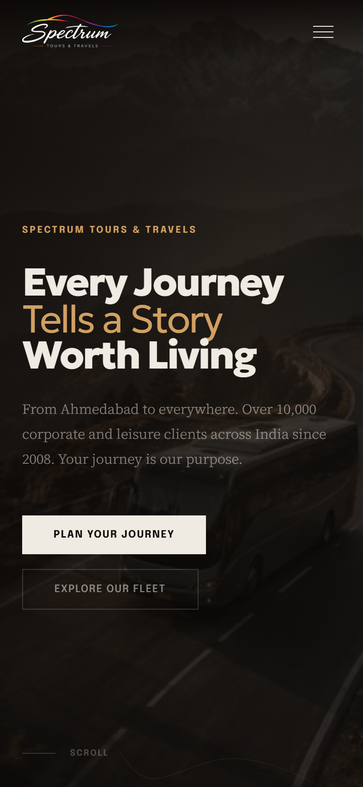
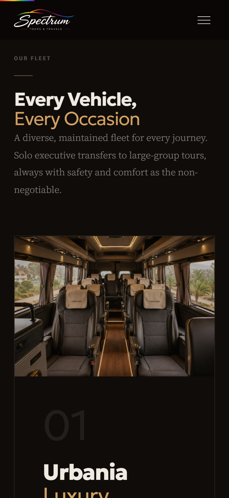
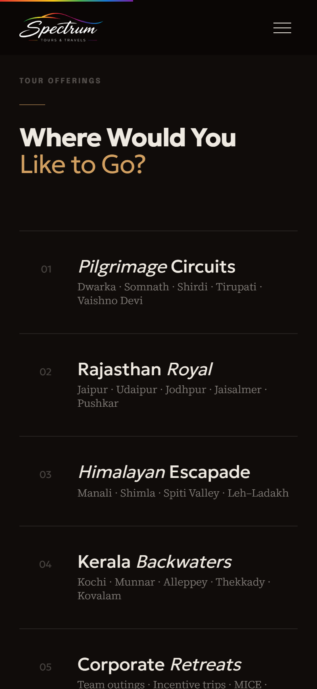
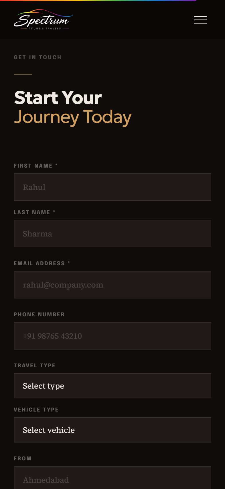
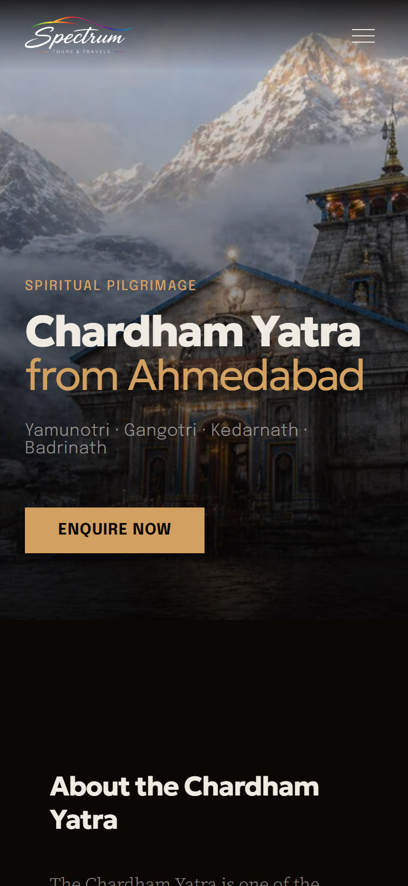

<p align="center">
  
</p>

<p align="center">
  <strong>The public website of Spectrum Tour &amp; Travel, Ahmedabad.</strong><br>
  Corporate transfers, staff transport, pilgrimage circuits and group tours, turned into calls, WhatsApp chats and enquiries.
</p>

<p align="center">
  <a href="https://www.spectrumtourandtravels.in"><strong>Open the site</strong></a>
  &nbsp;·&nbsp;
  <a href="#whats-on-it">What's on it</a>
  &nbsp;·&nbsp;
  <a href="#how-its-built">How it's built</a>
  &nbsp;·&nbsp;
  <a href="#run-it-locally">Run it locally</a>
</p>

<p align="center">
  
  
  
  
</p>

## Why it looks like this

Spectrum sells reliable movement: daily staff transport and executive cabs for companies like Mitsubishi Electric, Nestlé and Tata, and organised pilgrimage and leisure trips for families and groups. The site has two readers. A corporate travel desk wants proof (the fleet, the compliance numbers, the clients already served) and a fast way to ask for a quote. A family planning Chardham wants to see the vehicle and talk to a person.

So the design is calm and editorial rather than a tourism template: deep ink, warm cream and gold, with the rainbow of the Spectrum logo used once as a thin accent. Every section ends in a call, a WhatsApp chat or the enquiry form.

## Screenshots

<table>
  <tr>
    <td align="center"><br><sub>The first screen</sub></td>
    <td align="center"><br><sub>The fleet, vehicle by vehicle</sub></td>
    <td align="center"><br><sub>Where people go</sub></td>
    <td align="center"><br><sub>The enquiry form</sub></td>
    <td align="center"><br><sub>A route page</sub></td>
  </tr>
</table>

## What's on it

- **Corporate and leisure, side by side.** Two doors from the first screen: account-managed corporate travel, and tours for families and groups.
- **The fleet.** Urbania, sedans and SUVs, Tempo Travellers, mini buses and coaches, each with seats and what it is used for.
- **Why Spectrum.** Trained, ID-verified drivers, GPS on every vehicle, CCTV in staff buses, the Motor Transport Act registration, GST and PAN, and 24/7 support.
- **Tours.** Pilgrimage circuits, Rajasthan, the Himalayas, Kerala, Goa and corporate retreats.
- **Route pages** for Chardham Yatra, Somnath and Dwarka, and the Statue of Unity, each with its own itinerary, FAQ and booking buttons.
- **Trust.** The companies served, client stories, the company story since 2008 and a FAQ.
- **Enquiries.** Call, WhatsApp, or a form that sends straight to the office's inbox.

## How it's built

- **No framework, no build step.** `index.html`, `css/main.css` and `js/main.js`, served as they are. The only tooling is `scripts/convert-images.mjs`, which uses sharp to turn the source PNGs into 400, 800 and 1200 px WebP files for `srcset`.
- **Motion with plain JavaScript.** Sections reveal on scroll with an `IntersectionObserver`, and the custom cursor only runs on devices with a fine pointer.
- **Enquiries through Formspree.** The form posts to Formspree, which emails the office, so the site has no server to run.
- **Search and AI readers.** `TravelAgency`, `LocalBusiness`, `FAQPage` and service offers in JSON-LD, Open Graph and Twitter cards, a sitemap, a `robots.txt` that welcomes search and answer engines but turns away training-only scrapers, and an `llms.txt` with the company facts.
- **Clean addresses.** `vercel.json` serves `/chardham-yatra` and the other routes without `.html`, and `.htaccess` does the same on Apache hosting.
- **Canonical host** is `https://www.spectrumtourandtravels.in`; the bare domain redirects to it.

| Layer | Choice |
|---|---|
| Markup | Semantic HTML5 |
| Style | One CSS file with custom properties: ink, cream, gold, and a rainbow accent |
| Type | Geologica for display, Epilogue for UI, Source Serif 4 for reading |
| Script | Vanilla JavaScript, no dependencies |
| Forms | Formspree |
| Images | WebP in three sizes, made with sharp |
| Hosting | Vercel |

## Run it locally

No build step.

```bash
git clone https://github.com/IshaShaikh-03/spectrum-journeys.git
cd spectrum-journeys
npx serve .
```

Open http://localhost:3000. Opening `index.html` directly also works, but the clean route addresses need a server.

To refresh the README images: `python scripts/readme-shots.py` (Python with Playwright and Chrome).

## Project structure

```text
index.html                 the one-page site
chardham-yatra.html        route pages (served at /chardham-yatra, /somnath-dwarka, /statue-of-unity)
somnath-dwarka.html
statue-of-unity.html
404.html
css/main.css               every style
js/main.js                 reveals, menu, cursor, the enquiry form
assets/img/                photos (PNG sources and WebP sizes) and the brand marks
sitemap.xml robots.txt llms.txt site.webmanifest
vercel.json .htaccess      clean URLs on Vercel and Apache
scripts/                   image conversion, README screenshots
```

## Deploy

Pushing to `main` deploys to Vercel. `scripts/`, `docs/` and the README are left out of the deployment by `.vercelignore`.

## The operations app

Spectrum's drivers and office use a separate internal app for duties, fuel and live fleet GPS: `TheAlgo7/spectrum-operations-app` (private).

## Licence

Built for Spectrum Tour &amp; Travel by Gaurav Kumar, [The Algothrim](https://thealgothrim.com). All rights reserved.

The code is public to read and learn from. It is not licensed for reuse, and the photos, logo and company details belong to Spectrum Tour &amp; Travel.
